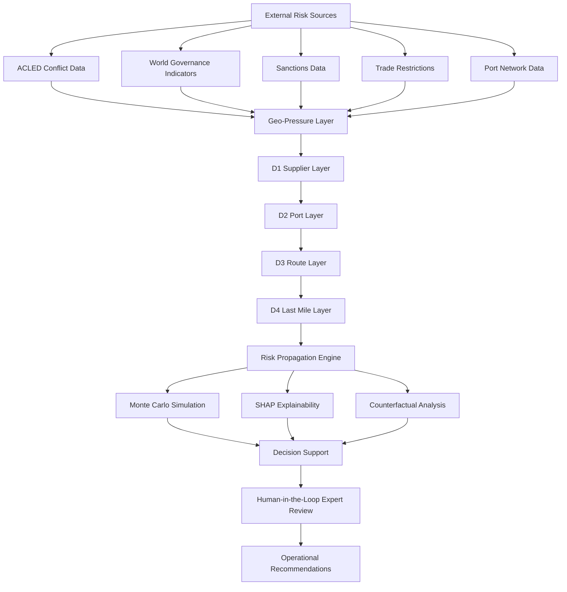

# 🌍 RYPE
## Risk Yield Propagation Engine

### Explainable Geopolitical Risk Propagation for Supply Chain Operations


---

# Overview

**RYPE (Risk Yield Propagation Engine)** is an interdisciplinary risk intelligence and decision-support research framework designed to analyze how geopolitical, governance, trade, and operational disruptions propagate across supply chains.

The project combines:

- Statistics & Risk Modeling
- Decision Science
- Network Science
- Explainable Artificial Intelligence (XAI)
- Supply Chain Risk Analytics

to generate interpretable risk intelligence rather than black-box disruption scores.

Originally initiated as an AI-driven cargo risk prediction study, the project evolved after the discovery of a major data leakage issue within a 650K+ record logistics dataset. Rather than reproducing a proprietary disruption score, RYPE focuses on understanding:

- Why disruptions emerge
- How risk propagates
- Which factors drive instability
- What interventions may reduce risk

across suppliers, ports, routes, and last-mile operations.

---

# Key Research Finding

> **External Risk Realism ≠ Operational Realism**

One of the central findings of the project is that realistic geopolitical indicators do not automatically generate realistic operational behavior.

During the research process, attempts to reconstruct a widely used disruption score from operational variables were unsuccessful, revealing a methodological gap between external risk indicators and actual operational dynamics.

This observation motivated the transition from predictive black-box modeling toward mechanism-driven risk propagation analysis.

---

# Academic Positioning

RYPE is positioned at the intersection of:

| Domain | Weight |
|----------|----------|
| Statistics & Risk Modeling | 30% |
| Decision Science | 25% |
| Network Science | 20% |
| Explainable AI | 15% |
| Supply Chain Analytics | 10% |

Machine Learning serves as an enabling component rather than the primary objective of the framework.

---

# Research Motivation

Traditional supply chain risk models often focus on prediction accuracy while providing limited insight into:

- Why disruptions occur
- How risk spreads across networks
- Which interventions are most effective
- How experts should interact with model outputs

RYPE aims to address these limitations by combining explainability, network propagation logic, uncertainty modeling, and expert-driven decision support.

---

# System Workflow & Decision Flow



---

# Core Architecture

The framework models disruption propagation through four interconnected operational layers:

| Layer | Description |
|---------|---------|
| D1 | Supplier Layer |
| D2 | Port Layer |
| D3 | Route Layer |
| D4 | Last-Mile Layer |

Rather than predicting a static disruption score, RYPE investigates how disruptions cascade throughout a supply chain network.

---

# Data Sources

The framework integrates multiple geopolitical and operational datasets:

### Geopolitical Sources

- ACLED Conflict Data
- World Bank Governance Indicators (WGI)
- EU / OFAC Sanctions Data
- Trade Restriction Indicators

### Network Sources

- UN/LOCODE Port Networks
- Maritime Transportation Data

### Operational Sources

- Logistics Datasets
- Delivery & Return Datasets
- Supply Chain Operational Variables

---

# Methodology

Core methodological components include:

### Black-Box Reconstruction Analysis

- XGBoost
- Random Forest
- MLP
- Regression-based reconstruction

Used to investigate disruption score reproducibility and identify leakage-related anomalies.

### Risk Modeling

- Multi-factor risk scoring
- Risk aggregation
- Scenario evaluation

### Network Propagation Analysis

- D1-D4 propagation architecture
- Cascading disruption modeling
- Operational dependency mapping

### Explainability & Decision Support

- SHAP explainability
- Counterfactual analysis
- Human-in-the-Loop (HITL)
- AHP-based expert weighting

### Uncertainty Modeling

- Monte Carlo simulation
- Scenario-based assessment
- Confidence-aware evaluation

---

# Evolution of the Project

## Phase 1 — Secure Cargo & Return Risk Prediction

Initial project scope:

- Cargo security prediction
- Return risk estimation
- Machine learning classification
- E-commerce logistics optimization

## Phase 2 — Logistics & Maritime Risk Research

Expanded focus:

- Maritime transportation risks
- Port operations
- Supply chain disruptions
- Network-oriented analysis

## Phase 3 — Leakage Investigation

A critical methodological anomaly was discovered:

- Extremely high predictive performance
- Black-box disruption score dependency
- Reconstruction failure
- Data leakage concerns

This phase fundamentally changed the direction of the project.

## Phase 4 — RYPE Framework

Current research focus:

- Geopolitical risk propagation
- Explainable risk intelligence
- Decision support systems
- Human-in-the-loop intervention analysis

---

# Academic Outputs

## 18th Statistics Student Colloquium

Presented findings related to:

**Methodological Anomaly in Supply Chain Risk Analysis:  
Black-Box Metrics, Leakage Effects, and Reconstruction Failure**

---

## 7th International Congress of Applied Statistics (UYIK 2026)

Accepted as an Oral Presentation and Full Paper:

**RYPE: Explainable Geopolitical Risk Propagation for Operational Supply Chain Instability Analysis**

---

## Ongoing Academic Work

- Journal manuscript preparation
- Framework refinement
- Additional validation studies
- Future publication submissions

---

# Repository Structure

```text
RYPE/
│
├── Literature Reviews
├── Research Reports
├── Project Guidelines
├── Academic Presentations
├── Architecture Diagrams
├── Data Collection Frameworks
├── MVP Development Files
├── Dashboard Designs
├── Research Notes
└── Future Research Plans
```

---

# Current Status

## Research Prototype → MVP Development

Current activities include:

- MVP dashboard development
- Interactive risk visualization
- Journal manuscript preparation
- Framework refinement
- Documentation standardization

---

# Future Roadmap

Planned extensions include:

### Data Integration

- AIS vessel tracking
- Port congestion intelligence
- Real-time geopolitical monitoring
- Historical disruption databases

### Advanced Modeling

- Propagation coefficient calibration
- Copula-based dependency modeling
  - Clayton Copula
  - Gumbel Copula
  - Vine Copula

### Decision Intelligence

- Reinforcement Learning route optimization
- Multi-Agent Adaptive Models
- Dynamic intervention policies

### Network Analytics

- Graph Neural Networks
- Dynamic network evolution
- Digital twin infrastructure

---

# Citation

If you use this repository or build upon this research, please cite the related conference paper and acknowledge the RYPE framework.

---

# License

This repository is intended for:

- Academic Research
- Educational Purposes
- Non-Commercial Development

Commercial deployment requires additional validation, real-world testing, and domain-specific adaptation.

---

## Author

**Meriç Özcan**  
Statistics Student | Risk Modeling & Decision Science | Explainable AI | Quantitative Research

Ege University — Department of Statistics

Research Interests:

- Risk Modeling
- Decision Science
- Explainable AI
- Network Science
- Supply Chain Risk Analytics
